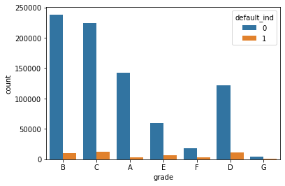
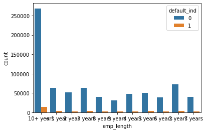
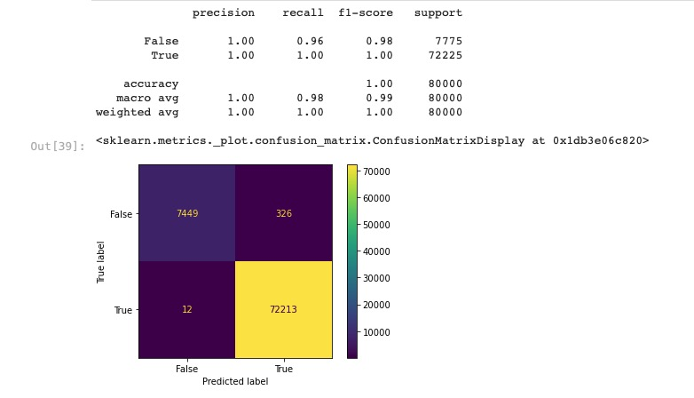

# Loan Default Prediction

This website showcases our final project for FIN 377 - Data Science for Finance course at Lehigh University. To see our complete analysis file, click [here](https://github.com/julioveracruz/testwebsite/blob/main/notebooks/example.ipynb).
**update analysis file link**
<br>
## Table of contents
1. [Introduction / Proposal](#introduction)
2. [Methodology](#meth)
    1. [Data Collection](#DC)
    2. [EDA](#EDA)
    3. [Pre-processing](#PP)
    4. [Base Model](#BM)
    5. [Initial Macro Model](#IM)
    6. [Interaction Macro Model](#IMM)
3. [Analysis](#Analysis)
4. [About the Team](#about)
<br><br>

## Introduction / Proposal <a name="introduction"></a>

The main goal of this project is to explore machine learning models that can best predict loan defaults using data such as standard loan factors, macroeconomic data, and market conditions. 
<br><br>
## Methodology <a name="meth"></a>

We outlined and completed this project through steps of:

- Data Collection
- EDA
- Pre-processing
- Optimizing
- Model Selection
<br>

### Data Collection <a name="DC"></a>
```python
lending = pd.read_csv("input/lending_data.csv")

inf = pdr.DataReader(["T5YIE"], "fred",datetime(2005,1,1), end =datetime(2022,4,1) )
inf.to_csv("input/inflation_exp.csv")

stfips = pd.read_csv("dev/state_fips.csv",skipinitialspace=True)

state_list = pd.DataFrame(lending["addr_state"].unique())
state_list = stfips.merge(state_list, on = "state", how  = "left")
``` 
We read leanding data that we downloaded from kaggle. This is our main dataset and what we build off of to incorporate other variables for our algorithm. Additionally included is some of the add-on data and modifications such as inflation from FRED. You can see the full download_data notebook [here](https://github.com/LeDataSciFi/project-loan-stars/blob/main/download_data.ipynb).
<br><br>
### EDA - Exploratory Data Analysis <a name="EDA"></a>
```python
print('There are',lending.shape[1],"columns")
lending.columns

lending.describe().T.style.format('{:,.2f}')

lending.describe(percentiles=[.01,.05,.95,.99]).T.style.format('{:,.2f}')

(
    (lending.isna().sum(axis=0)/len(lending)*100) 
    .sort_values(ascending=False)[:13].to_frame(name='% missing') .style.format("{:.1f}")    
    
    perc = 84.0
    min_count =  int(((100-perc)/100)*lending.shape[0] + 1)
    lending = lending.dropna(axis=1,thresh=min_count)
)
```
EDA is crucial to prepare data for machine learning. Above are main examples of EDA we did mostly on our base dataset, _lending_. We do this to better understand the data we are dealing with and how to best utilize it. The code shows us the columns, data shape, variabable summary statistics, percentiles, and even variables with missing values and what percentage is missing. We also dropped variables that had over 84% of values missing, as seen in the last code block.

Below are some examples of **_Visual_** EDA that we did to get a better sense of how variables relate to each other and observe major trends.


<br>
Loans that are defaulted have a higher interest rate, generally.
<br><br>


<br>
Doesn't seem to be any noticeable trends in loan grade and defaults.
<br><br>


<br>
Longer loans by far have more defaults but also by far more loans.
<br><br>

You can see the full status_report notebook of EDA [here](https://github.com/LeDataSciFi/project-loan-stars/blob/main/status_report.ipynb).
<br><br>
### Pre-processing <a name="PP"></a>
```python
lend = lending.drop(['default_ind' ], axis = 1)
rng = np.random.RandomState(0)

X_train, X_test, y_train, y_test = train_test_split(lend, y, stratify = y, test_size = 0.2, random_state = rng)

num_pipe = make_pipeline(SimpleImputer(), StandardScaler())
cat_pipe = make_pipeline(OneHotEncoder(handle_unknown='ignore'))

num_pipe_features = X_train.select_dtypes(include = "number").columns
num_pipe_features = [e for e in num_pipe_features if e not in dont_use]

preproc_pipe = ColumnTransformer(
    transformers = [
    ('num', num_pipe, num_pipe_features),
    ('cat', cat_pipe, cats)],
    remainder = 'drop'
)
``` 
Exemplified is our pre-model adjustments and setup. We dropped default indicator of course to avoid data leakage, and created random state. We split our data into testing and training data at a 80/20 split and stratified y to ensure the best representation of data. We created the number pipe using SimpleImputer and StandardScaler as usual, and the categorical pipe using OneHotEncoder. We selected numerical variables from the training data to be processed through the number pipe and vice versa, making sure to not use certain variables that we ruled out of our model.

Thus, we created our preprocessing pipe by using ColumnTransformer, combining the numerical pipe & features as well as the caategorical pipe & features, dropping the rest.
<br><br>
### Base Model <a name="BM"></a>
```python
logit = make_pipeline(preproc_pipe, LogisticRegression(max_iter = 1000))
logit.fit(X_train, y_train)

y_pred = logit.predict(X_test,)
print(classification_report(y_test, y_pred))
ConfusionMatrixDisplay.from_estimator(logit, X_test, y_test)
```
We creaated a logit model using the preprocessing pipeline, fit it to the training data, and predicted y test with our base model. We outputted the classification report and the confusion matrix for the model which can be seen below.
<br><br>

<br><br>
Next:
```python
def custom_prof_score(y, y_pred, roa=0.02, haircut=0.20):
    """
    Firm profit is this times the average loan size. We can
    ignore that term for the purposes of maximization. 
    """
    TN = sum((y_pred == 0) & (y == 0))  # count loans made and actually paid back
    FN = sum((y_pred == 0) & (y == 1))  # count loans made and actually defaulting
    return TN * roa - FN * haircut
# so that we can use the fcn in sklearn, "make a scorer" out of that function

prof_score = make_scorer(custom_prof_score)
```
We defined a profit function that we wanted to focus on as we are maximizing profit for a lending company.

Then:
```python
pipe = Pipeline([('columntransformer',preproc_pipe),
                 ('feature_create','passthrough'), 
                 ('feature_select','passthrough'), 
                 ('clf', LogisticRegression(class_weight='balanced', max_iter = 1000))
                ])

param_grid = [
    
    # baseline: last class's 3 variable logit, no feature creation or selection
    {'columntransformer': [preproc_pipe]},
    
    # now, try different feature selection methods (no creation, logit as estimator)
    dict(feature_select=['passthrough',
                          SelectKBest(f_classif,k=10),
                          SelectKBest(f_classif,k=20),
                          SelectKBest(f_classif,k=30),
                          ]),
    
    # now, try different feature creation methods (and possibly reduce the features after)
    {'feature_create': [
                        # this creates interactions between all variables
                        'passthrough'],
     'feature_select': ['passthrough']
    },
    
]

grid_search = GridSearchCV(estimator = pipe, 
                           param_grid = param_grid,
                           cv = 5, 
                           scoring=prof_score
                           )

results = grid_search.fit(X_train,y_train)
``` 
We created a pipeline to grid search with, and defined paramters. We used feature selection with "Kbest" and conducted a grid search using default CV of 5. We fit on the train data and outputted best estimator results which showed that no feature selection yielded the highest mean test score.
<br><br>
### Initial Macro Model <a name="IM"></a>
```python
Code Here.
``` 
<br><br>
### Interaction Macro Model <a name="IMM"></a>
```python
Code Here.
``` 
<br><br>
## Analysis <a name="Analysis"></a>


<br><br>
## About the Team <a name="about"></a>


<br>
Wasti is a Senior '22 Finance major with minors in Data Science and Mathematics. Upon graduation he will return to Lehigh as a Masters of Financial Engineering candidate.
<br><br><br>

<br>
Eric is a Senior '22 Finance major. Upon graduation he will begin his career as a Financial Services Advisory Associate at KPMG in their NYC Office.
<br><br><br>

<br>
Colin is a Senior '22 Finance major with a minor in Psychology.   


## More 

To view the GitHub repo for this website, click [here](https://github.com/etstieber/Loan-Stars).
