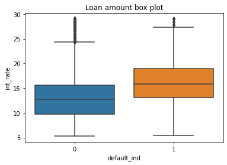

# Loan Default Prediction

This website showcases our final project for FIN 377 - Data Science for Finance course at Lehigh University. To see our complete analysis file, click [here](https://github.com/julioveracruz/testwebsite/blob/main/notebooks/example.ipynb).
**update analysis file link**
<br>
## Table of contents
1. [Introduction](#introduction)
2. [Methodology](#meth)
    1. [Data Collection](#DC)
    2. [EDA](#EDA)
    3. [Pre-processing](#PP)
    4. [Optimizing](#Op)
    5. [Model Selection](#MS)
3. [Analysis](#Analysis)
4. [Conclusion](#conclusion)
5. [About the Team](#about)
<br><br>

## Introduction  <a name="introduction"></a>

The main goal of this project is to explore machine learning models that can best predict loan defaults using data such as standard loan factors, macroeconomic data, and market conditions. 
<br><br>
## Methodology <a name="meth"></a>

We outlined and completed this project through steps of:

- Data Collection
- EDA
- Pre-processing
- Optimizing
- Model Selection
<br>

### Data Collection <a name="DC"></a>
```python
lending = pd.read_csv("input/lending_data.csv")

inf = pdr.DataReader(["T5YIE"], "fred",datetime(2005,1,1), end =datetime(2022,4,1) )
inf.to_csv("input/inflation_exp.csv")

stfips = pd.read_csv("dev/state_fips.csv",skipinitialspace=True)

state_list = pd.DataFrame(lending["addr_state"].unique())
state_list = stfips.merge(state_list, on = "state", how  = "left")
``` 
We read leanding data that we downloaded from kaggle. This is our main dataset and what we build off of to incorporate other variables for our algorithm. Additionally included is some of the add-on data and modifications such as inflation from FRED. You can see the full download_data notebook [here](https://github.com/LeDataSciFi/project-loan-stars/blob/main/download_data.ipynb).
<br><br>
### EDA - Exploratory Data Analysis <a name="EDA"></a>
```python
print('There are',lending.shape[1],"columns")
lending.columns

lending.describe().T.style.format('{:,.2f}')

lending.describe(percentiles=[.01,.05,.95,.99]).T.style.format('{:,.2f}')

(
    (lending.isna().sum(axis=0)/len(lending)*100) 
    .sort_values(ascending=False)[:13].to_frame(name='% missing') .style.format("{:.1f}")    
    
    perc = 84.0
    min_count =  int(((100-perc)/100)*lending.shape[0] + 1)
    lending = lending.dropna(axis=1,thresh=min_count)
)
```
EDA is crucial to prepare data for machine learning. Above are main examples of EDA we did mostly on our base dataset, _lending_. We do this to better understand the data we are dealing with and how to best utilize it. The code shows us the columns, data shape, variabable summary statistics, percentiles, and even variables with missing values and what percentage is missing. We also dropped variables that had over 84% of values missing, as seen in the last code block.

Below are some examples of **_Visual_** EDA that we did to get a better sense of how variables relate to each other and observe major trends.


<br><br>

<br><br>

<br><br>

<br><br>

You can see the full status_report notebook of EDA [here](https://github.com/LeDataSciFi/project-loan-stars/blob/main/status_report.ipynb).
<br><br>
### Pre-processing <a name="PP"></a>
```python
PP Code Here.
``` 
<br><br>
### Optimizing <a name="Op"></a>
```python
Optimizing Code Here.
``` 
<br><br>
### Model Selection <a name="MS"></a>
```python
Model Selection Code Here.
``` 
<br><br>
## Analysis <a name="Analysis"></a>

Here are some graphs that we created in our analysis. We saved them to the `pics/` subfolder and include them via the usual markdown syntax for pictures.


<br><br>
Some analysis here
<br><br>

<br><br>
More analysis here.
<br><br>

<br><br>
More analysis.
<br><br>
## Conclusion <a name="conclusion"></a>

xxx


<br><br>
## About the Team <a name="about"></a>


<br>
Wasti is a Senior '22 Finance major with minors in Data Science and Mathematics. Upon graduation he will return to Lehigh as a Masters of Financial Engineering candidate.
<br><br><br>

<br>
Eric is a Senior '22 Finance major. Upon graduation he will begin his career as a Financial Services Advisory Associate at KPMG in their NYC Office.
<br><br><br>

<br>
Colin is a Senior '22 Finance major with a minor in Psychology.   


## More 

To view the GitHub repo for this website, click [here](https://github.com/etstieber/Loan-Stars).
